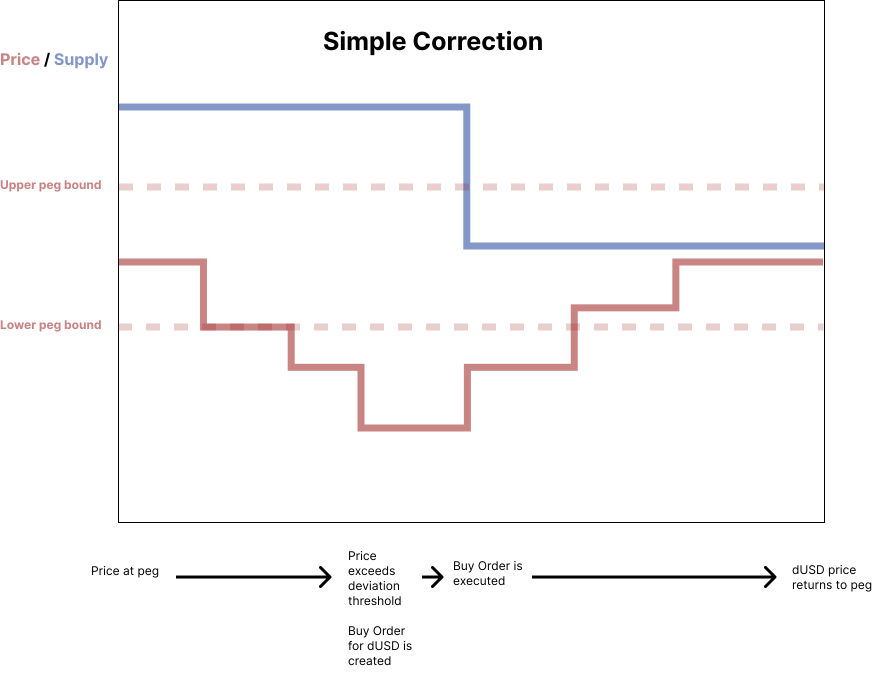
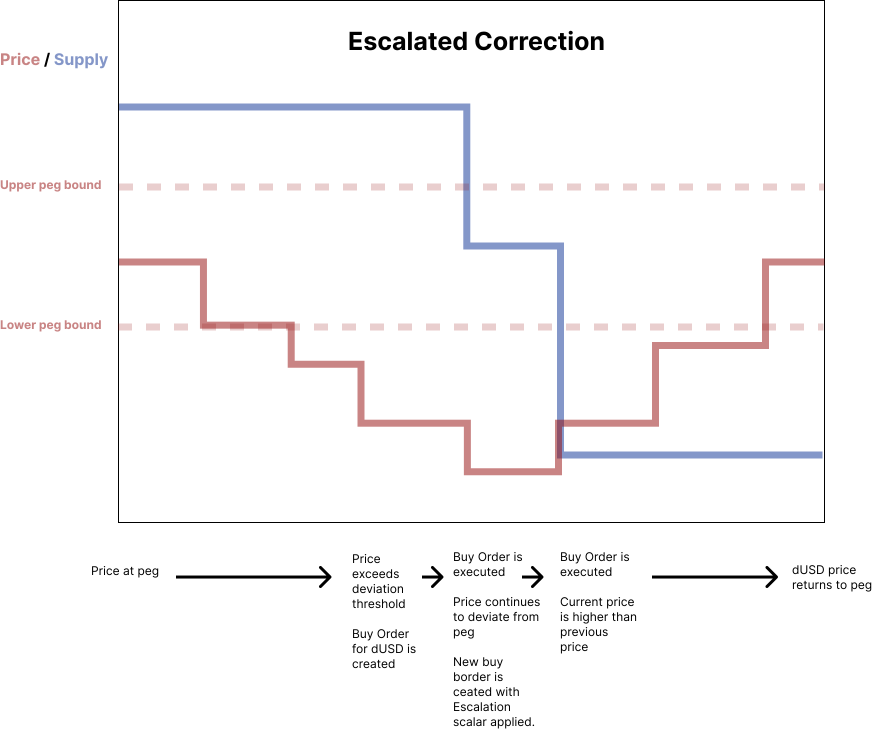

# Auction Sizing Algorithm

The auction sizing algorithm is designed to respond to events in peg deviation and adjusts the circulating supply of dUSD through minting and burning to drive it's value back to peg. The mechanism can be called at any point in time but will only execute market actions if the price is deviating from the peg.

## Capital Requirement

To enable the stabilization mechanism to perform below-peg price correction, enough capital needs to be available to buy excess dUSD from the market in exchange for ADA. This capital can be accumulated through exchanging the dUSD collected from vault stability fees for ADA and/or from dedicated protocol reserves.

## Parameters

Parameters can be adjusted to tune the effect.

- Lower peg bound, as in the minimum we allow the price to deviate.
- Upper peg bound, as in the maximum we allow the price to deviate.
- Deviation time threshold, as in max time the price can deviate from the peg for peg stabilization to occur. 
- Stabilization Interval, as in the length of time between market actions.
- Liquidity factor, as in a number between 0 and 1 that represents the portion of the circulating supply that is actually liquid.
- Order log size, as in the number of records of past orders to keep in the order log.

## Temporal Inputs

Temporal inputs are sourced from existing data and external feeds such as exchanges and indexes.

- Price of dUSD in USD
- Price of ADA in USD
- Circulating supply of dUSD
- Order log, which contains records of the most recent orders that were placed by previous runs where the order log size parameter dictates the number of records to hold. Each record contains the follow fields:
  - Order quantity
  - Order status, which can be either `Canceled` or `Complete`
  - Price of dUSD in USD when the order was created
  - Price of ADA in USD when the order was created
  - Circulating supply of dUSD when the order was created
  - Parameters when the order was created, as in the parameters defined above.


## Sizing Calculation

We calculate the quantity of stablecoin to burn/mint with the following equation:

```
quantity = escalationScalar * liquidityFactor * supply * (price - 1)
```
Where `escalationScalar` is a number that is used to escalate supply expansion when the peg has drifted significantly. It is calculated with the following logic:
```
If the current price and the previous price are both outside of the peg bounds and the current price has deviated further than the previous price, calculate the percentage at which it deviated, and 1 to it, and use that number to set the escalationScalar.

Else, set escalationScalar to 1.
```

## Algorithm

1. If there is an open order from the previous run, close it and push it's quantity, status, and the dUSD price and circulating supply at time it was created to the log.
2. Check if the average n most recent prices is within peg bounds, where n is the number dictated by the price deviation threshold. If so, exit. If not, continue.
3. After calculating supply adjustment quantity
    - If quantity is positive, initiate mint and sell order of dUSD of that quantity.
    - if quantity is negative, initiate a buy and burn order of dUSD of that quantity.

## Price Correction Behavior




